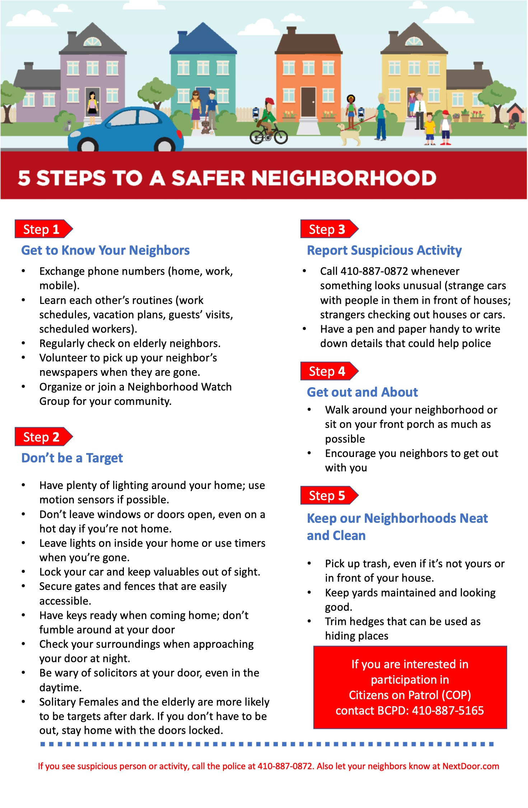

## Community History - Snippet 

The village of Relay is halfway between Baltimore and Ellicott City. It was created in 1830 as a change point, or “relay,” for horses hauling the first scheduled railroad cars in the United States.

## Unique Community attributes

Historic Relay and St. Denis is a vibrant destination. Nearby is the glorious Patapsco State Park and National historic landmark Thomas Viaduct. Relay is a popular destination for train, recreation and exercise enthusiasts. The picturesque streets highlight the glory of historic Baltimore County Maryland. 

* Well-preserved residential architecture

* Tradition of activism and community engagement

* Within Walking distance to Public Library and Senior Center

* Close to BWI

* MARC train to go to Washington DC.

## Community Location

A map of the Relay boundaries

## Relay Improvement Association and becoming a member

A small blurb about RIA link to page about the association?

call to action to become a memeber of the RIA and donate.

