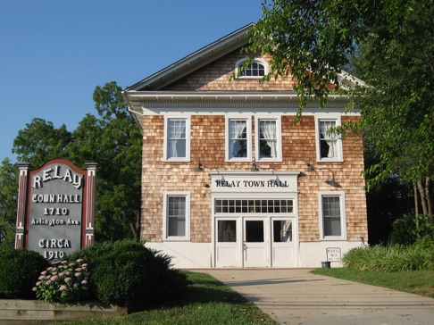

import YoutubeVideo from '../components/YoutubeVideo.astro';

The Relay Town Hall is one of our community's greatest treasures. This historic building has been around since the late 1800s and still stands proudly today. Located in the middle of Relay it serves as a time capsule, meeting place, party venue, and architectural gem.

In an effort to maintain this grand 2-story stature that is pleasing to anyone who stands in its presence, the hall is rented out for private events. The proceeds from these rentals are used exclusively to fund the ongoing maintenance that private citizens commit countless hours towards.

Relay Town Hall rentals allow small parties enjoy the quaint beauty of Relay. Most private parties use our hall for such functions as bridal showers, birthdays, and graduations where the guest list does not exceed 60. The hall is equipped with two bathrooms, a full sized kitchen, refrigeration and a parking lot for up to 15 cars. RIA members in good standing will receive a discount on rental rates. 

The RIA hosts it's quarterly general meetings at the Relay Town Hall welcoming neighbors, friends, and our district representatives from Baltimore County and the State of Maryland.

For additional information and availability, please [contact the Relay Improvement Association](/ria#contact).

<YoutubeVideo id='Gx5LFxJ_JY0' title="The Relay Town Hall"/>
