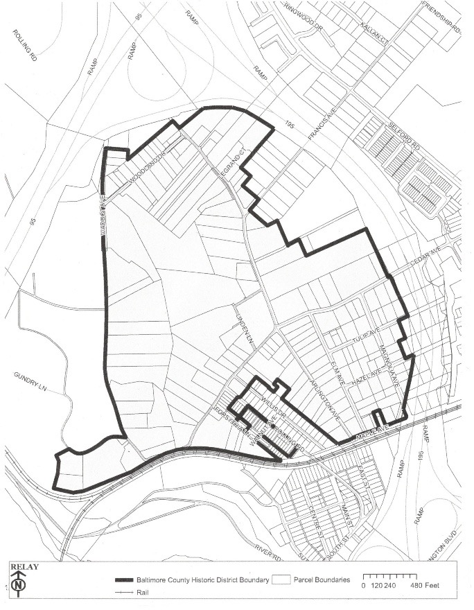

## Historic Home guide

### The Relay Historic District and the Landmarks Preservation Commission

In the 1990’s home-owners in the Relay neighborhood banded together and petitioned that the core of the neighborhood be designated a County Historic District.  This was done to preserve the unique architectural nature of the neighborhood, many of whose post-Civil War houses were built in the Victorian or Craftsman style.
The boundaries of the Relay Historic District can be seen in this map.  If you own a property within these boundaries, you are subject to the historic preservation regulations of Baltimore County.

The Landmarks Preservation Commission is the County commission charged with enforcing the historic preservation regulations in Baltimore County.   But what does that mean for you, the home-owner? 

### Renovations and Rehabilitations

If you want to renovate or rehabilitate any part of the **EXTERIOR** of your property, you will have to get a special permit from the LPC.   This would apply to changes to your roof, sidings, windows, doors, and trim.   It does NOT apply to repainting.   In general, they want to make sure that you preserve the original appearance of the building, and not make changes that would significantly change that appearance – e.g., replacing an historic slate or metal roof with asphalt shingles.
The LPC does NOT control what you do to the interior of your home, but see below for some tax credit benefits of interior renovations.
The forms and instructions on how to apply for these permits can be found at: [https://www.baltimorecountymd.gov/departments/planning/historic-preservation/historic-review](https://www.baltimorecountymd.gov/departments/planning/historic-preservation/historic-review)
The good news is that many homes built after about 1930 will not need extensive review, and can often be approved by the LPC staff without review by the whole LPC Commission.

### Minor Repairs

If you are just repairing some minor issues like replacing some window trim or missing shingles, this does not need LPC review, as long as you “replace like with like”, i.e., replace rotten window trim with the same material in the same style.  If you’re not sure if your work is too large to be considered a repair rather than a renovation, contact the LPC staff to check.  They tend to be very responsive.  They can be contacted at: [histpres@baltimorecountymd.gov] or by phone at [410-887-3495](410-887-3495).

### What if I don’t get the LPC permits?

If you don’t get permission for major renovations, you could be hit with code violation “stop work” orders from the County, incurring loss of time and extra costs, and even fines.

### Historic Tax Credit
So here’s the good news! If you own a historic home in the Relay Historic District, you may be able to get a tax credit for certain rehabilitation projects through Baltimore County.   This would mean 20% of your renovation costs rebated from your property tax bill.   This covers not only the exterior renovations noted above, but could also be applied for for interior renovations such as upgrades to your plumbing, electric, heating and cooling.   See their [Historic Rehabilitation Tax Credit](https://www.baltimorecountymd.gov/departments/planning/historic_preservation/taxcreditfaq.html) program to learn how to apply for the credit.

The State of Maryland’s Maryland Historic Trust offers its own tax credit program for an additional 20% rebate on your state income taxes, but they have their own application and review process.   See [https://mht.maryland.gov/Pages/funding/tax-credits-homeowner.aspx]

### Preservation

- [Landmarks Preservation Commission](https://www.baltimorecountymd.gov/boards-commissions/planning/landmarks-preservation-commission) - reviews and approves plans for alterations to historic structures
- [Maryland Inventory of Historic Properties](https://apps.mht.maryland.gov/mihp/MIHP.aspx) - includes information often used to determine if a property is eligible for designation as a Baltimore County Landmark
- [Baltimore County Historic Districts Boundaries Map](https://opendata.baltimorecountymd.gov/maps/BC-GIS::baltimore-county-historic-districts/about)
- [Historic Preservation in Baltimore County](https://www.baltimorecountymd.gov/departments/planning/historic_preservation/index.html)
- [Preservation Alliance of Baltimore County](https://preservationabc.org/) - non-profit organization dedicated to historic preservation in Baltimore County
- [Preservation Maryland](https://www.preservationmaryland.org/) - non-profit organization focused on revitalizing and reinvesting in historic communities, advocating, and building the historic trades workforce
- [Maryland Historical Trust](https://mht.maryland.gov/) is the state agency dedicated to preserving and interpreting the legacy of Maryland's past – through research, conservation and education. Includes information on the state income tax credit for qualified rehabilitation of historic properties in Maryland.
- [National Register of Historic Places](https://www.nps.gov/subjects/nationalregister/index.htm) is the official list of the Nation's historic places worthy of preservation. The website includes a helpful FAQ.

If you have more questions about the Relay Historic District and how to navigate historic preservation issues, contact your neighborhood liason to the LPC, Howard Wellman, [Hbwellman99@gmail.com](Hbwellman99@gmail.com) or [410-474-1226](410-474-1226).

## Safety and Security

### In Case of Emergency

Call Baltimore County Police Dispatch at [410-887-0872](410-887-0872), or call 911.

### Report security concerns

If you see a crime in progress call Baltimore County Police Dispatch at [410-887-0872](410-887-0872). PLEASE always start your message with your name, address, and phone number.

### Home vacancies

To inform the Baltimore County Police Department that you'll be out of town, submit a [house vacancy notice](https://resources.baltimorecountymd.gov/Documents/Police/2014pdfs/vacanthouseform141119.pdf) or email it to your [precinct](https://www.baltimorecountymd.gov/departments/police/precinctsgeneral/precinctsall.html).

### Baltimore County Police Department

Relay and St. Denis belong to [Precinct 1 – Wilkens](https://www.baltimorecountymd.gov/departments/police/pc01/index.html).

Residential Security Surveys can be requested via the Precinct 1 – Wilkens Outreach Unit at [410-887-5165](410-887-5165).

Report tips for non-emergency situations via the [Baltimore County Police Department's website](https://www.baltimorecountymd.gov/departments/police/).

