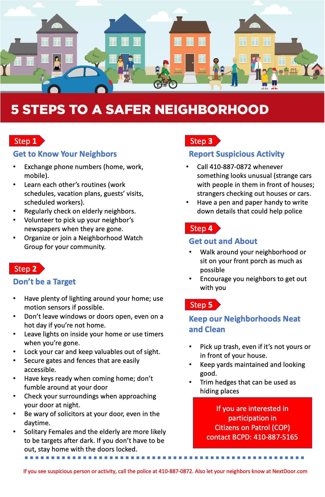

## Historic Home guide

### Historic Tax Credit

If you own a historic home in Relay/St. Denis, you may be able to get a tax credit for certain rehabilitation projects through Baltimore County. See their [Historic Rehabilitation Tax Credit](https://www.baltimorecountymd.gov/departments/planning/historic_preservation/taxcreditfaq.html) program to learn how to apply for the credit.

### Preservation

- [Landmarks Preservation Commission](https://www.baltimorecountymd.gov/boards-commissions/planning/landmarks-preservation-commission) - reviews and approves plans for alterations to historic structures
- [Maryland Inventory of Historic Properties](https://apps.mht.maryland.gov/mihp/MIHP.aspx) - includes information often used to determine if a property is eligible for designation as a Baltimore County Landmark
- [Baltimore County Historic Districts Boundaries Map](https://opendata.baltimorecountymd.gov/maps/BC-GIS::baltimore-county-historic-districts/about)
- [Historic Preservation in Baltimore County](https://www.baltimorecountymd.gov/departments/planning/historic_preservation/index.html)
- [Preservation Alliance of Baltimore County](https://preservationabc.org/) - non-profit organization dedicated to historic preservation in Baltimore County
- [Preservation Maryland](https://www.preservationmaryland.org/) - non-profit organization focused on revitalizing and reinvesting in historic communities, advocating, and building the historic trades workforce

### Maryland Historical Trust

[Maryland Historical Trust](https://mht.maryland.gov/) is the state agency dedicated to preserving and interpreting the legacy of Maryland's past – through research, conservation and education. Includes information on the state income tax credit for qualified rehabilitation of historic properties in Maryland.

### National Register of Historic Places

[National Register of Historic Places](https://www.nps.gov/subjects/nationalregister/index.htm) is the official list of the Nation's historic places worthy of preservation. The website includes a helpful FAQ.

## Safety and Security

### In Case of Emergency

Call Baltimore County Police Dispatch at [410-887-0872](tel:410-887-0872), or call 911.

### Report security concerns

If you see a crime in progress call Baltimore County Police Dispatch at [410-887-0872](tel:410-887-0872). PLEASE always start your message with your name, address, and phone number.

### Home vacancies

To inform the Baltimore County Police Department that you'll be out of town, submit a [house vacancy notice](https://resources.baltimorecountymd.gov/Documents/Police/2014pdfs/vacanthouseform141119.pdf) or email it to your [precinct](https://www.baltimorecountymd.gov/departments/police/precinctsgeneral/precinctsall.html).

### Baltimore County Police Department

Relay and St. Denis belong to [Precinct 1 – Wilkens](https://www.baltimorecountymd.gov/departments/police/pc01/index.html).

Residential Security Surveys can be requested via the Precinct 1 – Wilkens Outreach Unit at [410-887-5165](tel:410-887-5165).

Report tips for non-emergency situations via the [Baltimore County Police Department's website](https://www.baltimorecountymd.gov/departments/police/).

